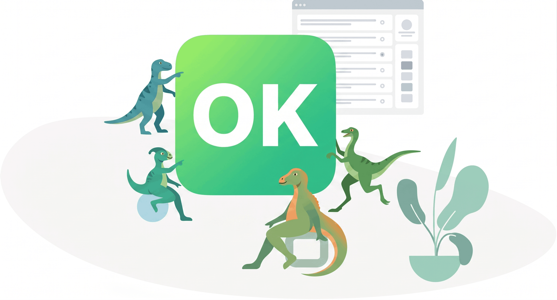

<div align="center">
  <p><b>A fork of Keystone 5, renamed to Open Keystone.</b></p>
  <p>Keystone 5 has been moved into maintenance mode by its original creators, who recommend <a href="https://keystonejs.com/" target="_blank">Keystone 6</a>. However, we believe Keystone 6 is architecturally less extensible than its predecessor. Therefore, we have created this fork, which we actively update and maintain.</p>
  <br>
</div>
<br>

<div align="center">
  
  <h1>Open Keystone</h1>
  <br>
  <p><b>A scalable platform and CMS to build Node.js applications.</b></p>
  <p><code>schema => ({ GraphQL, AdminUI })</code></p>
  <br>
  <p>Open Keystone comes with first-class GraphQL support, a highly extensible architecture, and a wonderful Admin UI.</p>
  <br>
</div>
<br>


[

## Contents

- [What's new](#whats-new)
- [Getting Started](#getting-started)
- [Documentation](#documentation)
- [Version Control](#version-control)
- [Contributing](#contributing)
- [Code of Conduct](#code-of-conduct)
- [License](#license)

## What's new?

`Open Keystone` is a fork of `Keystone 5`, which we maintain and enhance. It's built upon the solid foundation of Keystone 5 and is designed for modern web and mobile applications where flexible architecture and extensibility are key.

`Keystone 6` moved towards a more restricted internal architecture, which we found less suitable for complex use cases. By maintaining `Open Keystone`, we preserve the powerful GraphQL API with deep authentication & access control features, the extensible Admin UI, and the plugin-based system for field types, database adapters, and more.

We believe `Open Keystone` is a superior backend for rich React / Vue / Angular applications, Gatsby and Next.js websites, mobile applications, and headless CMS implementations.

## Getting Started

To get up and running with a basic project template using Open Keystone, follow the installation instructions below.

## Documentation

The [Open Keystone documentation](./docs/api) and [Guides](./docs/guides) provide a great starting point.

## Version control

We do our best to follow SemVer version control within Keystone. This means package versions have 3 numbers. A change in the first number indicates a breaking change, the second number indicates backward compatible feature and the third number indicates a bug fix.

You can find **changelogs** either by browsing our repository, or by using our [interactive changelog explorer](https://changelogs.xyz/@open-keystone/keystone).

A quick note on dependency management: Keystone is organised into a number of small packages within a monorepo. When packages in the same repository depend on each other, new versions might not be compatible with older versions. If two or more packages are updated, it can result in breaking changes, even though collectively they appear to be non-breaking.

We do our best to catch this but recommend updating Keystone packages together to avoid any potential conflict. This is especially important to be aware of if you use automated dependency management tools like Greenkeeper.

## Contributing

This project follows the [all-contributors](https://github.com/all-contributors/all-contributors) specification.

**Contributions of any kind are welcome!**

You will find the set-up steps in this readme and full release processes and project guidelines in [`CONTRIBUTING.md`](/CONTRIBUTING.md).

### Contributors

We'd like to start by thanking all our wonderful open keystone contributors:
([emoji key](https://allcontributors.org/docs/en/emoji-key)):

<!-- ALL-CONTRIBUTORS-LIST:START - Do not remove or modify this section -->
<!-- prettier-ignore-start -->
<!-- markdownlint-disable -->

<!-- markdownlint-restore -->
<!-- prettier-ignore-end -->

<!-- ALL-CONTRIBUTORS-LIST:END -->

### Demo Projects

These projects are designed to show off different aspects of OpenKeystone features
at a range of complexities (from a simple Todo App to a complex Meetup Site).

See the [`examples/README.md`](./examples/README.md) docs to get
started.

### Development Practices

All source code should be formatted with [Prettier](https://github.com/prettier/prettier).
Code is not automatically formatted in commit hooks to avoid unexpected behaviour,
so we recommended using an editor plugin to format your code as you work.
You can also run `yarn format` to prettier all the things.
The `lint` script will validate source code with both ESLint and prettier.

### Setup

Open Keystone is set up as a monorepo, using [Yarn Workspaces](https://yarnpkg.com/lang/en/docs/workspaces/). Make sure to [install Yarn](https://yarnpkg.com/lang/en/docs/install) if you haven't already.

First, clone the Open Keystone repository

```
git clone https://github.com/open-keystone/open-keystone.git
```

Also make sure you have a local MongoDB server running
([instructions](https://docs.mongodb.com/manual/installation/)).

Then install the dependencies and start the test project:

```shell
yarn
yarn dev
```

See [`examples/README.md`](./examples/README.md) for more details on
the available demo projects.

#### Note For Windows Users

While running `yarn` on Windows, the process may fail with an error such as this:

```shell
Error: EPERM: operation not permitted, symlink 'C:\Users\user\Documents\keystone\packages\arch\packages\alert\src\index.js' -> 'C:\Users\user\Documents\keystone\packages\arch\packages\alert\dist\alert.cjs.js.flow'
```

This is due to permission restrictions regarding the creation of [symbolic links](https://blogs.windows.com/windowsdeveloper/2016/12/02/symlinks-windows-10/). To solve this, you should enable Windows' [Developer Mode](https://docs.microsoft.com/en-us/windows/uwp/get-started/enable-your-device-for-development?redirectedfrom=MSDN) and run `yarn` again.

### Testing

Keystone uses [Jest](https://facebook.github.io/jest) for unit tests and [Cypress](https://www.cypress.io) for end-to-end tests.
All tests can be run locally and on [GitHub](https://github.com/open-condo-software/open-keystone/actions?query=workflow%3ACI).

### Unit Tests

To run the unit tests, run the script:

```shell
yarn jest
```

Unit tests for each package can be found in `packages/<package>/tests` and following the naming pattern `<module>.test.js`.
To see test coverage of the files touched by the unit tests, run:

```shell
yarn jest --coverage
```

### End-to-End Tests

Keystone tests end-to-end functionality with the help of [Cypress](https://www.cypress.io).
Each project (ie; `tests/test-projects/basic`, `tests/test-projects/login`, etc) have their own set of Cypress tests.
To run an individual project's tests, `cd` into that directory and run:

```shell
yarn cypress:run
```

Cypress can be run in interactive mode from project directories with its built in GUI,
which is useful when developing and debugging tests:

```shell
cd tests/test-projects/basic && yarn cypress:open
```

End-to-end tests live in `project/**/cypress/integration/*spec.js`.
It is possible to run all cypress tests at once from the monorepo root with the command:

```shell
yarn cypress:run
```

_NOTE: The output from this command will mix together the output from each project being tested in parallel._
_This is only recommended as a sanity check before pushing code._

## Code of Conduct

Open Keystone adheres to the [Contributor Covenant Code of Conduct](./code-of-conduct.md).

## License

Copyright (c) 2026 Open Condo Software. Licensed under the MIT License.
Based on the [KeystoneJS](https://github.com/keystonejs/keystone) MIT project.
